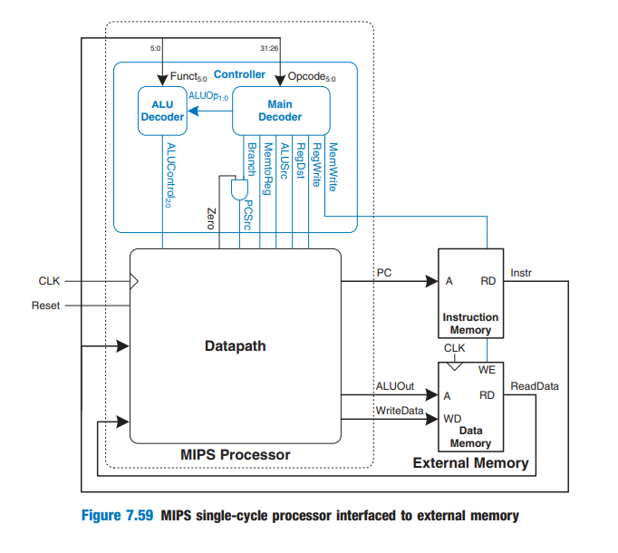
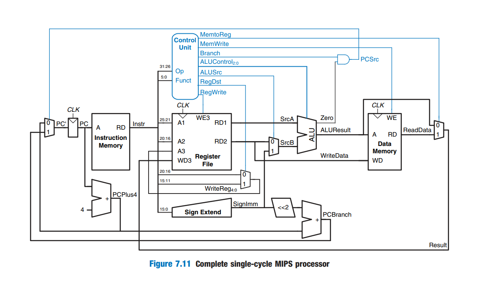
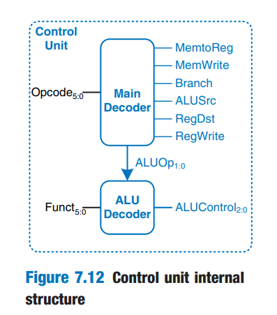
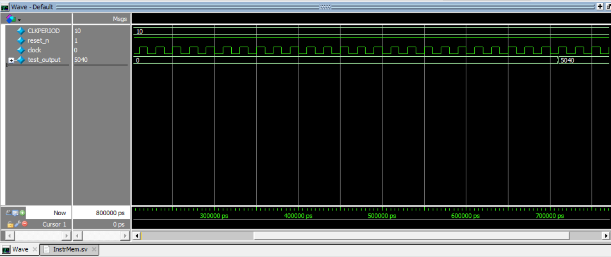
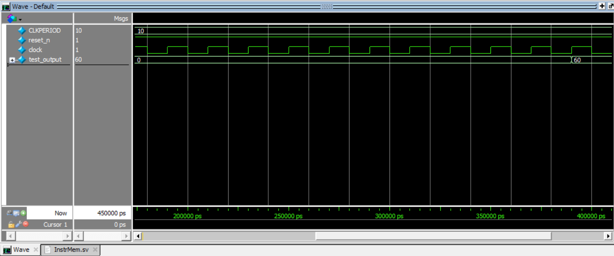
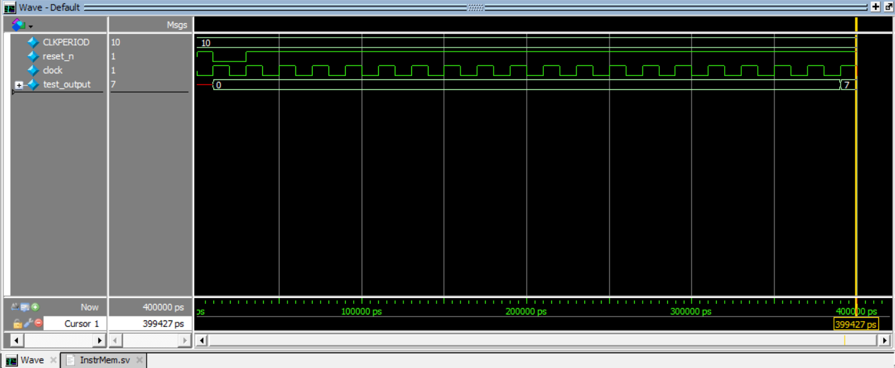

# MIPS Processor

## Summary

Implementation of 32-bit Single-Cycle MIPS processor based on Harvard architecture, MIPS processor is from the RISC family, It supports 3 different types of instructions such as: ***R-Type, I-type, and J-type***.
It is supported with a CLA Adder -Carry Look Ahead Adder- for fast computations.
The architecture relys on 3 main components: 
-   Control Unit.
-   Data Path.
-   Data/Instruction Memory.

**Table of contents**

- [Top](#top)
- [Architecture](#Architecture)
    - [Control Unit](#Control-Unit)
    - [Data Path](#Data-Path)
    - [Data Memory](#Data-Memory)
    - [Instruction Memroy](#Instruction-Memroy)
- [Test Programs](#Test-Programs)
    - [Factorial!](#Factorial!)
    - [GCD](#GCD)
    - [ad-hoc](#ad-hoc)
- [External Modules](#External-Modules)
- [About The Author](#about-the-author)
- [FPGA Implementaion](#fpga-implementation)
- [Reference](#Reference)

### Top

*   Full Architecture:

As illustrated in the figure bellow, the MIPS processor has four inputs: clk, reset_n, instruction, and read_data -Data to be read-.
it also has three outputs: pc -Program Counter-, alu_out, write_data -Data to be written-.

### Architecture

*   The figure below illustrates the harvard MIPS architecture in details:

#### Control Unit

The control unit is composed of two decoders: Main decoder and ALU decoder.
-   Main Decoder:
    -   Takes the *opcode* as input to determine eight control signals:
        *   MemtoReg: determines which data to be passed to the Register File either from Data Memory or ALU result.
        *   MemWrite: an enable signal for the Data Memory to be written in.
        *   Branch: this signal is ANDed with Zero flag to determine if there is a branch, thus determines the PC source.
        *   RegDest: Determines which field to be written in, in the Register File.
        *   RegWrite: an enable signal for the Register File to be written into.
        *   Jump: determines the source of the jump PC.
        *   ALUSrc: determines which source will be input for the ALU.
        *   ALUOp: input signal for the ALU decoder.
-   ALU Decoder:
    -   Takes the *funct* as input along side with ALUOp to determine the operation of the ALU:
        *   ALUControl: determines the operation of the ALU, whether it is ADD, SUB, MUL, SLT, AND, OR...etc.

#### Data Path

The Data Path is composed of several separate components, each is well designed and parametrized for re-useability.
-   Data Path Units:
    *   Five MUXs.
    *   Two Adders.
    *   Two Shifters.
    *   One SignExtend unit.
    *   One Register.
    *   An ALU.

#### Data Memory

-   It can be read from combinationally but written into sequentially at the rising edge of the clock.
-   It has a write enable which uses the *A -ALU OUT-* input as an adrress, and the data to be written is the *WD -RD2-*
-   In case the write enable is disabled, thus it uses the *A -ALU OUT-* input as an adrress to get the *ReadData* output from the memory. 

#### Instruction Memory

-   Its input is the PC it is fed to it at the rising edge, but the reading is combinaionally.

### Test Programs

-   Used three programs to test the functionality of the processor:
    *   Factorial of a number.
    *   The GCD of teo numbers.
    *   AD-HOC test fromt the reference.

#### Factorial!

*   Given the machine code for the factorial test:

-   The test: *[Factorial](https://github.com/MuhammadMajiid/MIPS-Processor/blob/main/Code/prog3.txt)*

*   The test's simulation:

#### GCD

*   Given the machine code for the GCD test:

-   The test: *[GCD](https://github.com/MuhammadMajiid/MIPS-Processor/blob/main/Code/prog2.txt)*

*   The test's simulation:

#### ad-hoc

*   Given the assembly code for the ad-hoc test:

-   The test: *[adhoc ASSMEBLY](https://github.com/MuhammadMajiid/MIPS-Processor/blob/main/Code/program_1.asm)*

*   Given the machine code for the ad-hoc test:

-   The test: *[adhoc](https://github.com/MuhammadMajiid/MIPS-Processor/blob/main/Code/prog2.txt)*

*   The test's simulation:

#### External Modules

-   Each of these module is parameterized and re-useable, there are more of them in the *[BasicBlock](https://github.com/MuhammadMajiid/BasicBlocks)* repo.

*   Adder: *[Adder](https://github.com/MuhammadMajiid/MIPS-Processor/blob/main/Code/Adder.sv)*
*   DFF: *[D-FF](https://github.com/MuhammadMajiid/MIPS-Processor/blob/main/Code/DFF.sv)*
*   MUX: *[MUX](https://github.com/MuhammadMajiid/MIPS-Processor/blob/main/Code/MUX.sv)*
*   ResetSynchronizer: *[RSTSYNCH](https://github.com/MuhammadMajiid/MIPS-Processor/blob/main/Code/ResetSynchronizer.sv)*
*   Shifter: *[Shifter](https://github.com/MuhammadMajiid/MIPS-Processor/blob/main/Code/Shifter.sv)*
*   SignExtend: *[SignExt](https://github.com/MuhammadMajiid/MIPS-Processor/blob/main/Code/SignExtn.sv)*

#### About The Author

**Author**: *Mohamed Maged Elkholy*

**Personal Email**: *majiidd17@icloud.com*

**Education**: *Electronics and communication department, Senior-1 student.*

**College**: *Faculty of Engineering, Alexandria university, Egypt.*

**Brief info.**: *Interested in Digital IC Design and Verification, seeking any chance to enhance my knowledge and empower my skills.*

#### FPGA Implementaion

***Soon!!***

#### Reference

-   Used the very handful, useful, and simple book **Digital Design and Computer Architecture** by **David Money Harris and Sarah L. Harris**
